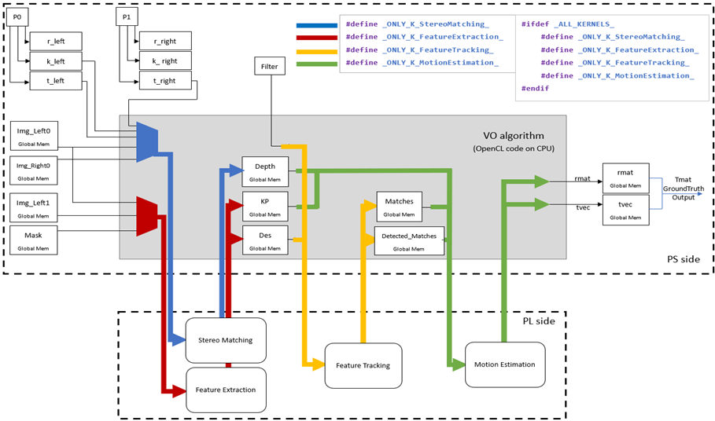

# FPGA Implementation of Visual Odometry using High-Level Synthesis
[](https://implementation.ee.nthu.edu.tw/competition/groups/d654e3e1-c800-43e4-8583-01de78e7f9eb/attachments/summary?download=0)

This repository contains the related work for the NTHU 11110EE 390000 / 11120EE 391000 Special Topic on Implementation (I)/(II) courses, specifically from [Team A288](https://implementation.ee.nthu.edu.tw/competition/groups/111/2). 

The contributors are as follows:


- [李承澔](https://github.com/Charlee0207)
- [林奕杰](https://github.com/yichiehqq)
- [鄧文瑜](https://github.com/kevinteng9023)
- [林妤諠](https://github.com/Yuhsuanlinn)
- [郭朝恩](https://github.com/ShinjuGoenji)


Most research and implementations in the field of VO focus on specific algorithms such as Stereo Matching, Feature Extraction, Feature Tracking (Matching), and Motion Estimation. In this project, we propose that these four stages of the VO algorithm can be implemented and executed on the Xilinx Alveo™ U50 FPGA board, thereby exploring the possibility of accelerating these algorithms in comparison to traditional CPU-based approaches.

## Abstract Development Flow and System Architecture

To begin, we selected a Python OpenCV tutorial on VO as a template and re-implemented it in C/C++ form with HLS synthesis accessibility. We removed all external library dependencies and eliminated CPU architecture-specific coding styles such as dynamic memory allocation and double-level pointers.


> The VO algorithm is divided into four sub-algorithms: Stereo Matching, Feature Extraction, Feature Tracking, and Motion Estimation. 



> Each sub-algorithm corresponds to a kernel.

In order to properly verify the functionality of each kernel, we included four compile modes to run the VO program. In each compile mode, the corresponding kernel function runs on the programmable logic (PL) side of the FPGA, while the other three functions run on the processing system (PS) side (the host). This ensures that each individual kernel behaves correctly and allows us to compare the execution time between the FPGA and the CPU.

## Toolchain and Prerequisites
The project has been tested in the following environment:
- CPU: 11th Gen Intel(R) Core(TM) i7-11700 @ 2.50GHz
- RAM: 49112592kB DDR4
- OS: Ubuntu 20.04.4 LTS
- FPGA: Xilinx Alveo™ U50 FPGA
- Vitis Suite Version: 2022.1
- OpenCV Version: 4.4.0

Prerequisites:
- Ubuntu 20.04 (or a higher version certified with Vitis)
- Xilinx Vitis Suite 2022.1 (or a higher version)
- Xilinx® Runtime (XRT)
- CMake 3.5+
- OpenCV-4.4.0 x86 library (or a higher version certified with [Vitis Vision Library](https://github.com/Xilinx/Vitis_Libraries/tree/main/vision))
- libOpenCL.so
- libpng library (optional)

## Prepare the Environment
### 1. Xilinx Vitis Suite
Install necessary dependencies before Vitis installation: 
```
$ sudo apt install libtinfo5 libncurses5 -y
```
And follow the offical installation [guide](https://docs.xilinx.com/r/2022.1-English/ug1400-vitis-embedded/Installation-Requirements).

### 2. Xilinx® Runtime (XRT) 
Install XRT environment and set up variables.
>  [Installing Xilinx Runtime and Platforms](https://docs.xilinx.com/r/en-US/ug1393-vitis-application-acceleration/Installing-Xilinx-Runtime-and-Platforms)

1. **[Go to Alveo U50 Package File Downloads](https://www.xilinx.com/products/boards-and-kits/alveo/u50.html#gettingStarted)**</br>
Download and install them in order</br>
`  Xilinx Runtime  `
`  Deployment Target Platform  `
`   Development Target Platform  `


2. **Set up variables**</br>

    Set up XILINX_VITIS and XILINX_VIVADO variables
    ```
    $ source <Vitis_install_path>/Vitis/2022.2/settings64.sh 
    ``` 
    Set up XILINX_XRT for data center platforms
    ```  
    $ source /opt/xilinx/xrt/setup.sh  
    ```

### 3. CMake
Install the latest CMake (Make sure cmake version>3.5 before proceeding).
>  [Ubuntu cmake 編譯安裝](https://shengyu7697.github.io/ubuntu-cmake/)
>  [How to Install CMake on Ubuntu 20.04 LTS](https://vitux.com/how-to-install-cmake-on-ubuntu/)

1. **[Go to CMake File Downloads](https://cmake.org/download/)** </br>
Download the source distribution `  cmake-<latest-version>.tar.gz  `
</br>

2. ****Remove previous CMake (If you have installed it before)***</br>
    Remove cmake and cmake-qt-gui
    ```
    $ sudo apt purge cmake
    ```
    Remove cmake and other dependencies
    ```
    $ sudo apt autoremove cmake
    ```

3. **Install it** </br>
    Extract it
    ```
    $ tar -zxvf cmake-<latest-version>.tar.gz
    ```
    Move to the extracted folder
    ```
    $ cd cmake-<latest-version>
    ```
    Run the following commands to compile and install
    ```
    $ ./bootstrap
    $ make
    $ sudo make install
    ```
    Check the installed CMace version
    ```
    $ cmake --version
    ```

### 4. OpenCV-4.4.0 x86 library
Libraries **should not** be builded at shared folder!
> [Install OpenCV-Python in Ubuntu](https://docs.opencv.org/4.4.0/d2/de6/tutorial_py_setup_in_ubuntu.html)


1. **Building OpenCV from source**</br>
    Required build dependencies 
    ```
    # CMake to configure the installation, GCC for compilation, Python-devel and Numpy for building Python bindings etc.
    $ sudo apt-get install cmake
    $ sudo apt-get install gcc g++

    # to support python3:
    $ sudo apt-get install python3-dev python3-numpy
    
    # GTK support for GUI features, Camera support (v4l), Media Support (ffmpeg, gstreamer) etc
    $ sudo apt-get install libavcodec-dev libavformat-dev libswscale-dev
    $ sudo apt-get install libgstreamer-plugins-base1.0-dev libgstreamer1.0-dev

    # to support gtk3:
    $ sudo apt-get install libgtk-3-dev
    ```
    We skip installation of 2 dependencies below: 
    `sudo apt-get install python-dev python-numpy` `sudo apt-get install libgtk2.0-dev` 
    
    And install optional dependencies
    ```
    $ sudo apt-get install libpng-dev
    $ sudo apt-get install libjpeg-dev
    $ sudo apt-get install libopenexr-dev
    $ sudo apt-get install libtiff-dev
    $ sudo apt-get install libwebp-dev
    ```

3. **[Download OpenCV-4.4.0 Repository](https://github.com/opencv/opencv/tree/4.4.0)**</br>
    Download whole repository into a folder named as `opencv`.</br>
    
    Open a terminal window and navigate to the downloaded `opencv` folder. 
    Create a new "build" folder and navigate to it.
    ```
    $ mkdir build
    $ cd build
    ```
4. **Configuring and Installing**</br>
    Configuration of OpenCV library build (executed from build folder)
    ```
    $ cmake ../
    ```
    OpenCV defaults assume `Release` build type and installation path is `/usr/local`.</br>
    
    You should see these lines in your CMake output (they mean that Python is properly found):
    ```
    --   Python 3:
    --     Interpreter:                 /usr/bin/python3.4 (ver 3.4.3)
    --     Libraries:                   /usr/lib/x86_64-linux-gnu/libpython3.4m.so (ver 3.4.3)
    --     numpy:                       /usr/lib/python3/dist-packages/numpy/core/include (ver 1.8.2)
    --     packages path:               lib/python3.4/dist-packages
    ```
    Now build the files
    ```
    $ make
    $ sudo make install
    ```
     All files are installed in `/usr/local/` folder. Open a terminal and try import `cv2`.
     ```
     import cv2 as cv
    print(cv.__version__)
    ```
    
    
### 5. libOpenCL.so</br>

> [OpenCL Installable Client Driver Loader](https://docs.xilinx.com/r/en-US/ug1393-vitis-application-acceleration/OpenCL-Installable-Client-Driver-Loader?tocId=rL1XqX3uRUq6DWvD71c6qQ)


* **Ubuntu**</br>
On Ubuntu the ICD library is packaged with the distribution. Install the following packages:
    ```
    $ sudo apt-get install ocl-icd-libopencl1
    $ sudo apt-get install opencl-headers
    $ sudo apt-get install ocl-icd-opencl-dev
    ```
    </br>
    
### 6. libpng library (optional)

> [Official Repository Installation Guide](https://github.com/glennrp/libpng/blob/libpng16/INSTALL)
> [How to install libpng-1.6.37.tar.xz in ubuntu 20.04?](https://askubuntu.com/questions/1267837/how-to-install-libpng-1-6-37-tar-xz-in-ubuntu-20-04)


1. **[Download libpng Repository](https://github.com/glennrp/libpng)**</br>
    Download whole repository into a temporary folder,
    or type GitHub CLI command under a temporary folder
    ```
    $ gh repo clone glennrp/libpng
    ```
    
2. **Configuring and Installing**</br>
    ```
    $ cd libpng
    $ ./autogen.sh
    $ ./configure --prefix=/usr/local/libpng
    $ make check
    $ sudo make install
    ```
   
Appendix 

`< path-to-opencv-lib-folder >` = `/usr/local/lib` 
`< path-to-opencv-include-folder >` = `/usr/local/include/opencv4`
`< path-to-platform-directory >/< platform >.xpfm` = `/opt/xilinx/platforms/xilinx_u50_gen3x16_xdma_5_202210_1/xilinx_u50_gen3x16_xdma_5_202210_1.xpfm`


## Directory Structure of This Repository
   ```
    ${ThisRepository}
      |- SGBM
      |   |- c_src
      |   |- hardware
      |   \- program
      |
      |- feature-extraction
      |   |- c_src
      |   |- hardware
      |   \- program
      |
      |- feature-tracking
      |   |- c_src
      |   |- hardware
      |   \- program
      |
      |- motion-estimation
      |   |- c_src
      |   |- hardware
      |   \- program
      |
      |- host
      |   |- host-src
      |   |   |- C_FeatureExtraction  
      |   |   |- C_FeatureTracking
      |   |   |- C_MotionEstimation
      |   |   |- C_StereoMatching
      |   |   |- BasicFunction.cpp
      |   |   |- BasicFunction.hpp
      |   |   |- Host.cpp
      |   |   |- Host.hpp
      |   |   |- Matrix.h
      |   |   |- Parameter.hpp
      |   |   \- libpng.tar.gz
      |   |
      |   \- output.zip
      \- dataset.zip (Linked below)
   ```
   Please download the [dataset.zip](https://drive.google.com/file/d/10q1iml4rOL9GB1Ew3EcNF0lm_c7B5Nf_/view?usp=drivesdk) from drive and unzip.

## Quick Start (Build From CLI Script)

### Build Bitstream from Each Kernel Function
Please reference the `README.md` in each kernel function([SGBM](SGBM), [feature-extraction](feature-extraction), [feature-tracking](feature-tracking), [motion-estimation](motion-estimation)) to build binary.
### Setup Host Program Behavier

You can modify the behavior of the host program in `Parameters.hpp`. There are 3 sections that you can modify:

1. Include Section

   In this section, you need to ensure that the header file of the pure C code is correct.
2. Macro Section

   * You can complie the program in pure C code, only one kernel in HLS code, or all kernels in HLS code using 6 provided macros.
   * You can print the program's progress on terminal with ``_INFO_``
   * You can write the output of the function to a .txt file with ``_PRINT_``
3. Parameter Section

   In this section, you are required to specify the path to the output folder on your computer while following the directory structure outlined below:

   ```
    ${ProjectFolder}
      |- ${HostFolder}
      |   |- src
      |   |   |- C_FeatureExtraction  
      |   |   |- C_FeatureTracking
      |   |   |- C_MotionEstimation
      |   \   \- C_StereoMatching
      |- output  
      |   |- C_FeatureExtraction  
      |   |- C_FeatureTracking
      |   |- C_MotionEstimation
      |   |- C_StereoMatching
      |   |- K_FeatureExtraction
      |   |- K_FeatureTracking
      |   |- K_MotionEstimation
      |   \- K_StereoMatching
      |- dataset
      |   |- poses
      \   \- sequences 
   ```
   

</br>

## Quick Start (Build From GUI)

### Setup Vitis

1. Create an empty application project using `xilinx_u50` as the platform.
2. Import the host code to the `src` folder under `<ProjectName>[x86]` and kernel code to the `src` folder under `<ProjectName>_kernels` in the Explorer panel.
3. Add kernel functions in the `<ProjectName>_kernels.prj` project editor.
4. Right-click `<ProjectName>.prj` and select **Properties**.
   Add the following includes and libraries in the **Properties**:

   * **C/C++ Build > Settings > Tool Setting > GCC Host Compiler(x86_64) > Includes**
   
     Add the path ``<path-to-opencv-include-folder>`` to **Include paths(-l)*.
   
     If you have installed `libpng` library, please add the path ``<path-to-libpng-folder-where-you-installed>`` to **Include paths(-l)**.  
     Alternatively, if you choose to use the extracted  `libpng` library, please add the path ``<path-to-libpng-folder-where-you-unzipped>`` to **Include paths(-l)**
     
     
   * **C/C++ Build > Settings > Tool Setting > GCC Host Linker(x86_64) > Libraries**

     Add the path ``<path-to-opencv-lib-folder>`` to **Library search path(-L)**.
     
     If you have installed `libpng` library, please add the path ``<path-to-libpng-folder-where-you-installed>`` to **Include paths(-l)**.  
     Alternatively, if you choose to use the extracted  `libpng` library, please add the path ``<path-to-libpng-folder-where-you-unzipped>`` to **Include paths(-l)**.
     
     
     
     Then add the following libraries:
     
     ``opencv_videoio`` ``opencv_imgcodecs`` ``opencv_core`` ``opencv_imgproc`` ``opencv_features2d`` ``opencv_flann`` ``opencv_video`` ``opencv_calib3d`` ``opencv_highgui`` ``png``
     
     to **Libraries(-l)**.
5. Click the **Run** button (green button at the top panel) to add configurations

   * Double-click **System Project Debug** and click the generated **SystemDebugger**
   * Edit **Program Arguments** and provide arguments as below:
   
     ```
     <path-to-leftimage-folder> <path-to-rightimage-folder> <path-to-calib-file> <number-of-frames> <platform-vendor> <device-name>
     
     e.g. 
     /home/chngh/Desktop/Host/dataset/sequences/00/image_0/ /home/chngh/Desktop/Host/dataset/sequences/00/image_1/ /home/chngh/Desktop/Host/dataset/sequences/00/calib.txt 12 Xilinx xilinx_u50_gen3x16_xdma_5_202210_1
     ```
     
     Enable **Automatically add binary container(s) to arguments**
   * Edit **Configuration** and enable **OpenCL trace**


   **Note:** 
   * If you run the pure C code, please delete ``<platform-vendor>`` ``<device-name>`` arguments, and disable **Automatically add binary container(s) to aruments**
   * When you run the HLS code host program, you can choose to load the ``.xclbin`` binary into FPGA directly, rather than regenerating ``.xclbin`` binary.
      If you want to load binary directly, please disable **Automatically add binary container(s) to aruments**, and add the ``<path-to-{KERNEL}.xclbin>`` as last argument in **Program Arguments** .
   </br></br>

### Setup Host Program Behavier

You can modify the behavior of the host program in `Parameters.hpp`. There are 3 sections that you can modify:

1. Include Section

   In this section, you need to ensure that the header file of the pure C code is correct.
2. Macro Section

   * You can complie the program in pure C code, only one kernel in HLS code, or all kernels in HLS code using 6 provided macros.
   * You can print the program's progress on terminal with ``_INFO_``
   * You can write the output of the function to a .txt file with ``_PRINT_``
3. Parameter Section

   In this section, you need to verify that the name of the main function in your kernel is correct. Additionally, you are required to specify the path to the output folder on your computer while following the directory structure outlined below:

   ```
    ${ProjectFolder}
      |- ${HostFolder}
      |   |- src
      |   |   |- C_FeatureExtraction  
      |   |   |- C_FeatureTracking
      |   |   |- C_MotionEstimation
      |   \   \- C_StereoMatching
      |- output  
      |   |- C_FeatureExtraction  
      |   |- C_FeatureTracking
      |   |- C_MotionEstimation
      |   |- C_StereoMatching
      |   |- K_FeatureExtraction
      |   |- K_FeatureTracking
      |   |- K_MotionEstimation
      |   \- K_StereoMatching
      |- dataset
      |   |- poses
      \   \- sequences 
   ```

## Result
The output trajectory should be write to `OUTPUT_FOLDER_PATH ` in `parameter.hpp`.
And here's demo.


https://github.com/bol-edu/robotics-computing/assets/85032763/5f17a207-c9ef-431d-83b0-bc3079efb19e
> trajectory of 2000 iterations generated with `ground truth`, `self-contain C code`, `FPGA kernel`.


